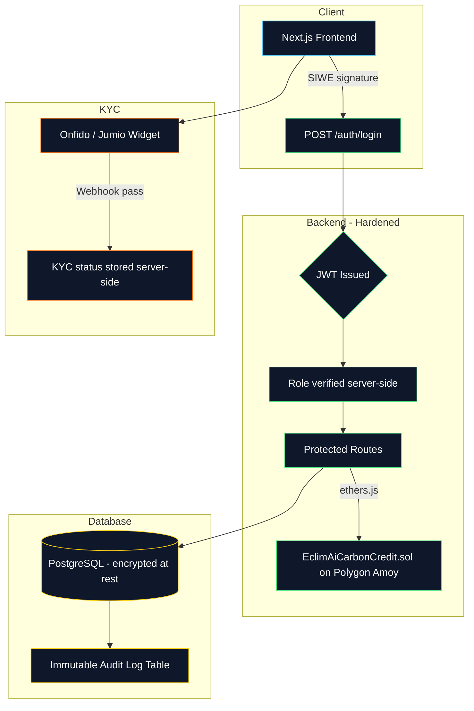
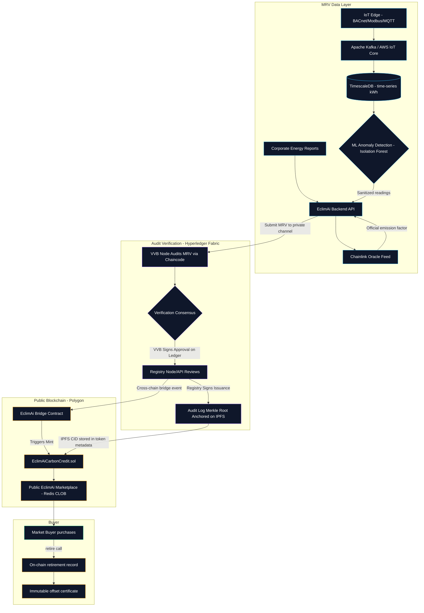
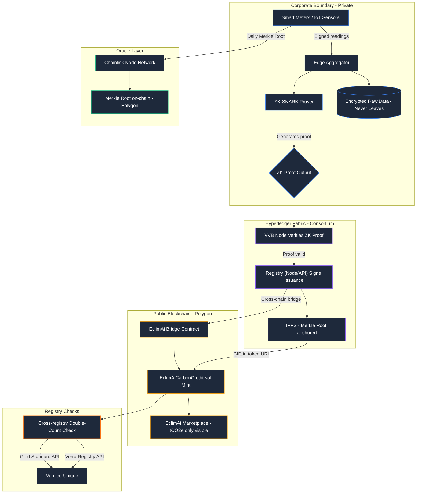

# EclimAi — Enterprise Production Architecture

*Note: This document describes the target production architecture roadmap for EclimAi. It outlines how the system will evolve from the current streamlined prototype into a privacy-preserving, enterprise-grade decentralized carbon registry protocol once transaction volume and real-world deployment justify the infrastructure investment.*

---

## Design Principles

1. **Zero raw data exposure** — corporations never reveal energy kWh figures publicly
2. **No single point of trust** — no single server controls minting
3. **Immutable provenance** — every credit has a cryptographically verifiable origin chain
4. **Regulatory compliance by design** — KYC, AML, double-counting prevention built in
5. **Multi-chain liquidity** — private verification, public tradability

---

## Phase 1: Secure the Foundation

The current prototype must be hardened before any external users or real tokens.

### Key Changes
- Replace SQLite with **PostgreSQL** with row-level security
- Add **JWT authentication** with wallet signature verification (SIWE — Sign-In With Ethereum) and **EIP-712 typed data signatures** for robust message authentication.
- Wire the Admin mint flow to call the **actual `EclimAiCarbonCredit.sol`** on Polygon Amoy via `ethers.js`/`viem`
- Move admin wallet private key to **AWS KMS (HSM-backed)** — key is never extractable from hardware; the server requests KMS to sign the minting transaction
- Add `helmet.js`, `express-rate-limit`, and input validation (`zod`) to all routes
- Implement rigorous **server-side sessions** utilizing modern crypto protocols to mitigate authentication risks.
- Integrate a real **KYC provider** (Onfido or Jumio) for Market Buyers before purchases are accepted
- Deploy containerized microservices via **Docker + Kubernetes (EKS/GKE)**, with all infrastructure defined as code using **Terraform** for zero-downtime deployments and instant disaster recovery
- Add **Prometheus + Grafana** observability stack and **Cloudflare WAF** at the network edge

#### Diagram: EclimAi Phase 1 (Hardening the Prototype)

---

## Phase 2: Decentralized Verification

Replace centralized auditor trust with a **multi-party consensus network** and anchor audit logs on-chain.

### Key Changes
- **Chainlink Data Feeds** replace hardcoded emission factors. Factor values fetched from an on-chain oracle, updated by an authorised node network on a government regulatory schedule
- **Automated IoT Ingestion** — replaces manual CSV uploads. Smart meters transmit data via BACnet/MQTT to Apache Kafka, which stores time-series data in TimescaleDB.
- **ML Anomaly Detection** — an Isolation Forest model sanitizes the incoming IoT data stream to prevent fraudulent or erroneous readings before they reach the backend API.
- **IPFS + Merkle Root anchoring** - on each state transition (approve, reject, retire), the audit log Merkle root is pinned to IPFS and the CID is stored in the token's on-chain metadata
- **Hyperledger Fabric Consortium (Private MRV Processing Engine)** — a private, permissioned Fabric network operates as a collaboration space for **EclimAi**, **Validation/Verification Bodies (VVBs)**, and **Registries (Verra/Gold Standard)**. EclimAi provides the infrastructure. VVBs operate as node operators to audit data, while Registries integrate directly (either running a node or via a secure API gateway) to retain sole authority to approve issuance.
- **Registry Authorized Issuance** — replace single-wallet minting. Once a VVB approves the MRV on Fabric, the Registry reviews it and signs the issuance. This authorized event triggers EclimAi's bridge to mint the ERC-1155 token on Polygon.

#### Diagram: EclimAi Phase 2 (Decentralized Consortium)

---

## Phase 3: Zero-Knowledge Privacy

The most sensitive data — exact corporate energy consumption figures — must never be public. Phase 3 replaces the plain-text calculation model with **ZK-SNARKs**.

### How It Works
A corporation generates a cryptographic proof **locally on their own hardware** that mathematically demonstrates:

> `(Baseline_kWh - Actual_kWh) × Emission_Factor = Avoided_tCO2e`

…without revealing `Baseline_kWh` or `Actual_kWh` to anyone. Only the proof and the final `tCO2e` output are submitted to the registry.

### Key Changes
- **ZK-SNARK Prover Server** runs in the corporation's own data centre
- **Fabric Chaincode** verifies the ZK proof — no raw energy data crosses the corporate boundary. The VVB node simply verifies the mathematical proof on Fabric.
- **IoT Hardware Signing** — smart meters sign readings cryptographically at the edge; a Chainlink Oracle aggregates them into a daily **Merkle Root** committed on-chain. Any retroactive tampering invalidates the Merkle Root instantly

#### Diagram: EclimAi Phase 3 (Zero-Knowledge Privacy)

---

## Phase 4: Commercial Scaling: The Dual-Pronged Business Model

EclimAi is architected to capture both immediate software revenue and long-term asset value.

> **Note:** Open-source tools such as Hedera Guardian (generic dMRV policy engine) and Thallo (Verra-compliant registry bridge) exist in adjacent infrastructure space. EclimAi is the vertical application layer—providing domain-specific energy calculations, IoT integrations, and a native marketplace—built above such components.

### Revenue & Growth Model

| Product | Description | Target |
|---------|-------------|--------|
| **Data Pipeline SaaS** | Charge clients a recurring software license fee to use the calculation/Merkle anchoring engine. EclimAi acts as an "audit-ready" data pipeline and collects commissions from VVBs for routing pre-processed clients to them. | Broad market adoption |
| **Marketplace Fees** | A high-frequency off-chain **CLOB (Central Limit Order Book)** backed by Redis matches buy/sell orders at zero gas cost. Settlement is atomic and on-chain only when a trade executes, capturing a transaction fee on every matched trade. | Enterprise buyers, Traders |
| **"Discount-for-Credits" Strategy** | Offer upfront hardware/software subsidies (e.g., a €3,000 HVAC integration discount) in exchange for contractual rights to 100% of the resulting carbon savings, tokenized and sold directly by EclimAi. | High-yield, long-term asset generation |

---

## Technology Upgrade Roadmap

| Milestone | Phase | Component | Replaces |
|-----------|-------|-----------|---------|
| JWT + SIWE auth | 1 | Node.js backend | `localStorage` role |
| PostgreSQL | 1 | Database | SQLite |
| TimescaleDB | 1 | Time-series store | SQLite for IoT readings |
| Kafka / Confluent Cloud | 1 | Stream ingestion | HTTP POST |
| Kubernetes + Terraform | 1 | Cloud infra (EKS/GKE) | Manual server management |
| Cloudflare WAF + Prometheus | 1 | Observability & edge security | None |
| AWS KMS (HSM) | 1 | Admin key management | `.env` private key |
| Real on-chain mint | 1 | `ethers.js` → contract | SQL status update |
| Helmet + rate limiting | 1 | Express middleware | Unprotected routes |
| Real KYC provider | 1 | Onfido/Jumio | Simulated name input |
| Chainlink emission factors | 2 | Oracle feed | Hardcoded frontend values |
| IPFS audit anchoring | 2 | Pinata/web3.storage | Mutable SQLite log |
| Safe multi-sig minting | 2 | Gnosis Safe | Single admin wallet |
| Hyperledger Fabric | 2 | Consortium chain | Centralised backend |
| ML anomaly detection | 2 | Isolation Forest / LSTM | No data sanitization |
| Off-chain CLOB orderbook | 2 | Node.js + Redis matching engine | Simple buy/sell UI |
| ZK-SNARK prover | 3 | Circom / Groth16 | Plain-text kWh transfer |
| IoT hardware signing (TEE) | 3 | ARM TrustZone edge gateway | Manual CSV uploads |
| BACnet / Modbus / MQTT | 3 | Industrial IoT protocols | HTTP POST |
| Merkle Root oracle | 3 | Chainlink DON | Per-record hashing |
| Cross-registry check | 3 | Gold Standard / Verra API | Attestation checkbox |
| Protocol licensing | 4 | White-label SaaS | Single-tenant product |
