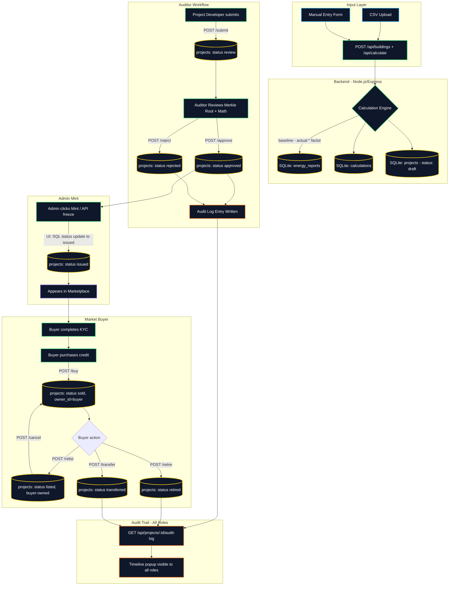

# EclimAi Prototype Architecture

*Note: This document describes the architecture of the EclimAi prototype as **currently implemented** — a working proof-of-concept demonstrating the core logic and workflow using a streamlined stack (Next.js, simulated smart contract minting, and local SQLite data management). For the enterprise production architecture roadmap, see [Future Architecture](./architecture-future.md).*

---

## Stack

| Layer | Technology |
|-------|-----------|
| Frontend | Next.js 15, React, TypeScript, Tailwind CSS, shadcn/ui |
| Backend | Node.js, Express, TypeScript, SQLite (via `sqlite3` + `sqlite`) |
| Smart Contracts | Solidity 0.8.20, ERC-1155, OpenZeppelin, Foundry test suite |
| Blockchain (simulated) | Polygon Amoy testnet (UI simulated; contract deployed but mint flow not yet wired end-to-end) |

---

## User Roles

| Role | Capability | Real-World Equivalent |
|------|-----------|------------------------|
| **Project Developer** | Upload CSV / manual MRV data, submit for audit, see Issued/Rejected status | Corporate Project Developer |
| **Auditor** | Review submitted reports, verify Merkle root integrity, Approve or Reject | **VVB (Validation and Verification Body)** |
| **Admin** | Mint tokens to marketplace after Registry API freeze (UI-simulated; SQL status update) | **EclimAi Bridge Node** |
| **Market Buyer** | Complete KYC, browse marketplace, purchase credits, re-list, transfer, or retire | Corporate Offset Buyer |

Role management is handled via secure session protocols in production (currently simulated in the prototype environment).

---

## Data Flow

> **Note:** The diagram below depicts the current **prototype** implementation (SQLite-based). The production-path tables in the "Production Architecture Path" section at the bottom of this document describe the full enterprise stack.

#### Diagram: EclimAi Prototype Data Flow (Streamlined Stack)


---

## API Reference

| Method | Endpoint | Role | Description |
|--------|----------|------|-------------|
| `POST` | `/api/buildings` | Developer | Register a building |
| `GET` | `/api/buildings` | All | Fetch all buildings |
| `POST` | `/api/calculate` | Developer | Submit MRV, compute tCO₂e, create draft project |
| `GET` | `/api/projects` | All | Fetch all projects (joined with energy reports, calculations) |
| `POST` | `/api/projects/:id/submit` | Developer | Move draft → review |
| `POST` | `/api/projects/:id/approve` | Auditor | Move review → approved |
| `POST` | `/api/projects/:id/reject` | Auditor | Move review → rejected |
| `POST` | `/api/projects/:id/issue` | Admin | Mint tokens to marketplace (updates status to issued) |
| `POST` | `/api/projects/:id/buy` | Buyer | Move `issued`/`listed` → `sold`; set `owner_id=buyer` |
| `POST` | `/api/projects/:id/relist` | Buyer | Move `sold` → `listed`; set buyer price |
| `POST` | `/api/projects/:id/transfer` | Buyer | Move `sold` → `transferred`; log recipient in audit |
| `POST` | `/api/projects/:id/cancel` | Buyer/Admin | Revert listing; buyer → `sold`, admin → `approved` |
| `POST` | `/api/projects/:id/retire` | Buyer | Move `sold` → `retired`; accepts `{ beneficiary, purpose }` |
| `GET` | `/api/projects/:id/audit-log` | All | Fetch full timeline for a project |
| `GET` | `/api/system/info` | Public | Returns `bootTime` timestamp for KYC validation |
| `POST` | `/api/auth/claim-admin` | Admin | Grants admin role in DB (secret code: demo only) |

---

## Database Schema (SQLite)

```
users              — wallet_address, role
buildings          — owner_id → users, name, location
energy_reports     — building_id, baseline_kwh, actual_kwh, emission_factor, estimated_avoided_tco2e
calculations       — energy_report_id, formula, inputs_json, result_tco2e
projects           — building_id, energy_report_id, calculation_id, status, price, owner_id, beneficiary, purpose, reviewer_id, double_counting_attestation
audit_log          — project_id, from_status, to_status, actor, timestamp, notes
```

Status lifecycle: `draft → review → approved / rejected → issued → sold → listed / retired / transferred`

---

## Smart Contract (EclimAiCarbonCredit.sol)

- **Standard:** ERC-1155 (multi-token, supports batch minting)
- **Network:** Polygon Amoy testnet
- **Roles:** `ISSUER_ROLE`, `VERIFIER_ROLE`, `MARKETPLACE_ADMIN_ROLE` (OpenZeppelin AccessControl)
- **Features:** Mint, batch mint, list for sale, buy, cancel listing, retire with beneficiary/purpose
- **Guards:** `Pausable` (emergency stop), `ReentrancyGuard` (marketplace)
- **Tests:** 7 Foundry unit tests covering unauthorized mint, duplicate issuance, unowned listing, ownership transfer, retired-credit transfer block, double retirement, and batch minting

---

## Data Integrity (Prototype Implementation)

- Client-side Merkle root generated from each project's raw data using `crypto.subtle`
- Building names containing `(Tampered)` are flagged with `isHashValid: false` in the UI
- CSV import has a **~15% random chance** of injecting a tampered row to demonstrate the auditor rejection flow
- All audit log entries written atomically with each status transition

---

## Current Known Gaps

See [security.md](./security.md) for the full findings. Short list:
- CORS wildcard (open to all origins)
- No JWT/auth on any API route
- Admin secret is hardcoded (`'2026'`)
- Role and KYC trust client `localStorage`
- No input validation / rate limiting
- Mint not wired to actual on-chain transaction
- SQLite not suitable for production

---

## Production Architecture Path

This section bridges the prototype to enterprise scale. The items below are not implemented in the prototype but represent the concrete engineering decisions required for a production deployment. Full phase-by-phase roadmap is in [Future Architecture](./architecture-future.md).

### Physical Edge Layer (IoT → Cloud)
| Component | Prototype | Production |
|-----------|-----------|------------|
| Data source | CSV upload / manual form | BMS systems (Siemens Desigo, Honeywell Forge) via **BACnet / Modbus** protocols |
| Transmission | HTTP POST | **MQTT** over TLS from IoT gateways |
| Hardware trust | None | **TEE (Trusted Execution Environment)** — e.g., ARM TrustZone signs readings cryptographically at chip level before leaving the building |
| Stream ingestion | Express route | **Apache Kafka** (self-hosted) or **Confluent Cloud / AWS Kinesis** (managed) for high-throughput stream processing |

### Database Topology
| Store | Prototype | Production | Purpose |
|-------|-----------|------------|---------|
| Core state | SQLite | **PostgreSQL (RDS/Cloud SQL)** | Users, KYC, project metadata — ACID-compliant |
| Time-series | SQLite | **TimescaleDB** | Millions of timestamped kWh readings from IoT sensors |
| Orderbook cache | — | **Redis** | Sub-millisecond marketplace bid/ask state; session management |
| Private ledger | — | **Hyperledger Fabric** | Immutable VVB audit trails before Merkle root goes public |

### AI Data Sanitization
Before any calculation is run, the incoming IoT stream passes through an ML sanitization layer:
- **Isolation Forest:** Detects statistical outliers in the kWh stream (e.g., a sensor reporting -500 kWh, or a zero-reading gap spanning 3 days). Flagged readings are quarantined before reaching the calculation engine.
- **LSTM (Long Short-Term Memory) Neural Networks:** Models complex non-linear seasonal baselines when a building's energy profile is too irregular for standard IPMVP linear regression alone. In 2025-2026, pre-trained time-series models (e.g., Google's TimesFM) offer an alternative to training a custom LSTM on limited IoT data.

### Marketplace Orderbook (Off-Chain CLOB + On-Chain Settlement)
Writing every marketplace bid or ask directly to the blockchain would cost users gas fees just to cancel an order. Production uses a hybrid model:

1. **Off-Chain CLOB:** Node.js + Redis maintains a Central Limit Order Book in memory (zero gas, millisecond latency).
2. **EIP-712 Typed Signatures:** Buyers cryptographically sign their purchase *intent* with their wallet — no on-chain broadcast yet.
3. **Atomic Settlement:** When the matching engine pairs a buyer and seller, both signatures are submitted to the Polygon smart contract in a single transaction. The contract atomically swaps USDC for the ERC-1155 token.

### Security & Key Management
| Concern | Prototype | Production |
|---------|-----------|------------|
| Admin minting key | `.env` / hardcoded | **AWS KMS (HSM-backed)** — key never extractable; server requests KMS to sign the tx. For Web3-native deployments, **Fireblocks MPC** or **Lit Protocol** (decentralized MPC key management) are credible alternatives. |
| KYC enforcement | Simulated name check | **Polygon ID** (ZK-proof-based identity attestations) or **Verax Attestation Registry** — on-chain, privacy-preserving KYC enforcement that avoids the undeployed ERC-4973 SBT standard |
| API protection | None | **OAuth2 / OpenID Connect** with short-lived JWTs (15 min) + HttpOnly refresh cookies |
| Network edge | None | **Cloudflare WAF** — blocks SQL injection, XSS, DDoS before reaching Express |
| Observability | Console logs | **Prometheus + Grafana** metrics; **Datadog / ELK Stack** log aggregation |
| Infrastructure | Manual | **Terraform** (IaC) + **Kubernetes (EKS/GKE)** for container orchestration and auto-scaling |

---
📖 [README](../README.md) · 🚀 [Future Architecture](./architecture-future.md) · 🔐 [Security Audit](./security.md) · ⚠️ [Known Limitations](../known-limitations.md)
